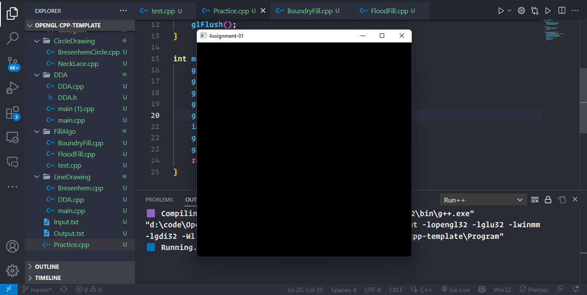

# Assignment-01 - Install and explore the OpenGL

#### Here is a simplified procedure for installing OpenGL on Windows and setting it up with Visual Studio Code (VS Code). Keep in mind that while this approach may be suitable for basic usage, certain functions or assignments may not work optimally. Nonetheless, it provides a favorable setup for smaller projects.

### To set up OpenGL on Windows and configure it with Visual Studio Code, follow the detailed steps below:

## 1. Download the required folder:

- _Go to the provided link and download the folder containing the necessary
  OpenGL files. Make sure to save it to a location on your computer. Open the
  downloaded folder in Visual Studio Code:_

### 2. Launch Visual Studio Code on your system.

- _In the main menu, click on "File" and select "Open Folder"._
- _Navigate to the downloaded folder and select it to open it in Visual Studio
  Code._
- **Ensure that the folder you opened matches the one shown in the accompanying
  figure for accurate reference.\***

### 3. Use Run++ VS Code Extension to Run Code

- _The Run++ extension will compile your C++ code and execute it, providing the
  output in the integrated terminal within Visual Studio Code. This allows for a
  convenient way to run and test your OpenGL code using the extension's
  features._

## Output

</img>

### By following these steps, you will have successfully downloaded the required OpenGL files and opened the corresponding folder in Visual Studio Code. This will allow you to proceed with configuring and utilizing OpenGL for your development tasks.
