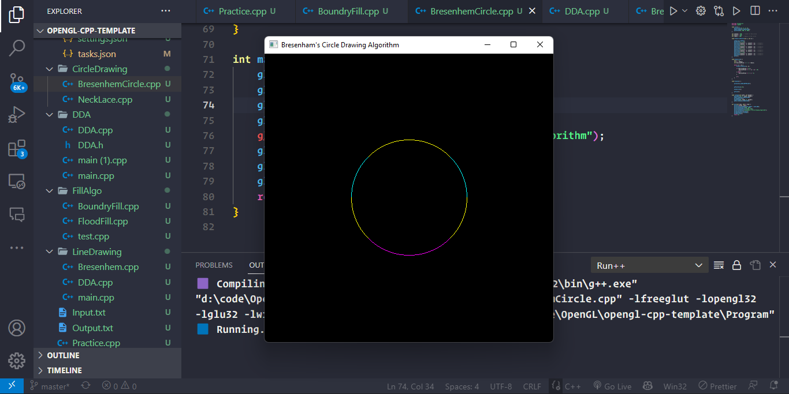
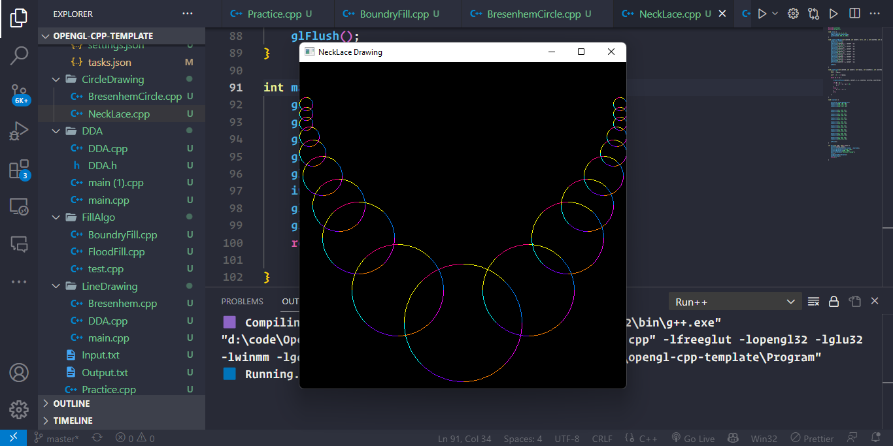

# Assignment-03

### Problem Statment : Implement Bresenham circle drawing algorithm to draw any object. The object should be displayed in all the quadrants with respect to center and radius

### Output ScreenShots

### Bresenham Circle Drawing Algorithm - [Code](BresenhamCircle.cpp)

</img>

### Necklace Drawing - [code](Necklace.cpp)

</img>
