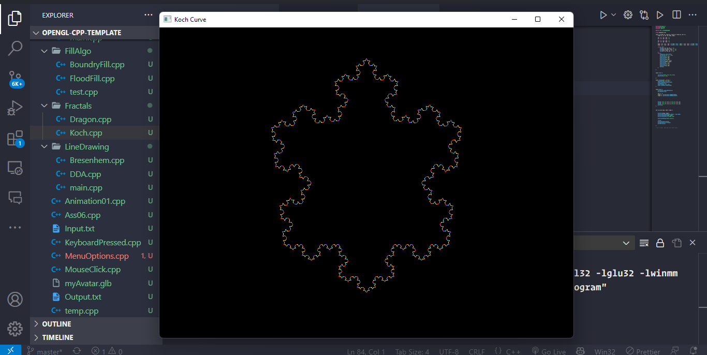

# Assignment-07

### Problem Statement - Generate fractal patterns using  &nbsp;&nbsp;&nbsp;&nbsp;i) Bezier  &nbsp;&nbsp;&nbsp;&nbsp;ii) Koch Curve

### Output ScreenShots

### Koch Curve - [Code](Koch.cpp)

</img>
